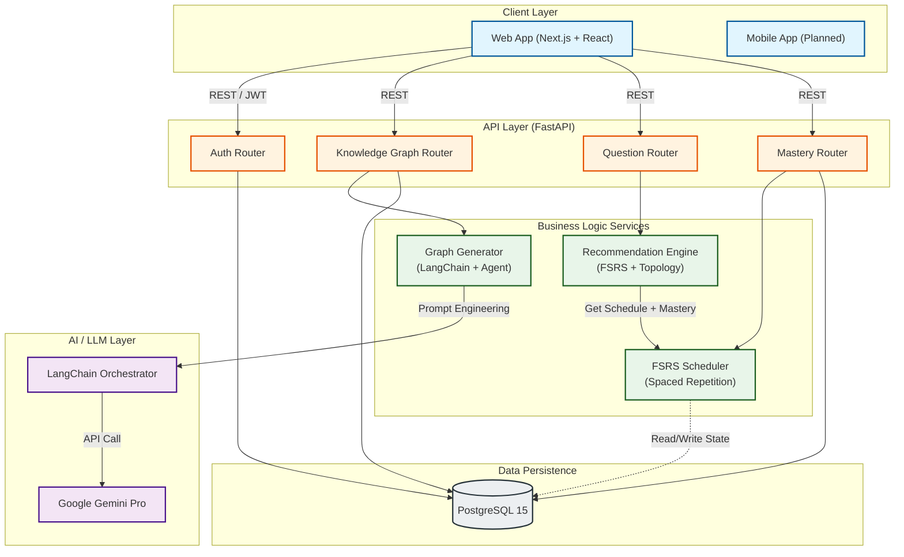
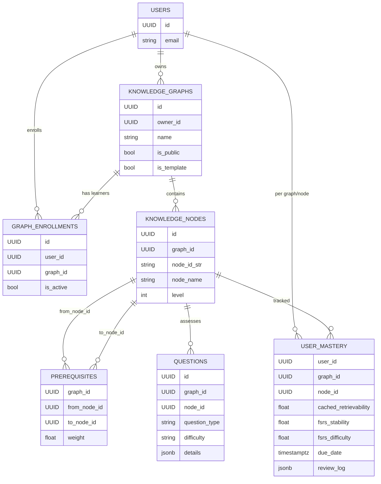

# System Architecture

## Data Flow Description

1.  **Adaptive Learning Loop**:
    *   User requests a question via **Web App**.
    *   **Recommendation Engine** queries **PostgreSQL** for current mastery state.
    *   **FSRS** filters for due reviews and supplies stability/retrievability.
    *   **RecEngine** sorts by prerequisites/topology, urgency, and mastery gap.
    *   Optimal question is returned.

2.  **AI Content Generation**:
    *   User uploads a PDF.
    *   **PDF Extractor** uses **Gemini 2.5 Flash** (Files API) for multimodal text extraction.
    *   **Graph Generator** uses **Gemini 3 Pro** to extract knowledge nodes and relationships.
    *   **Refinement Agent** validates and corrects graph topology (e.g., re-routing parent dependencies).
    *   **Question Generator** creates adaptive questions for leaf nodes.

## Core Data Model (ERD)

- `USER_MASTERY` is the FSRS store keyed by `(user_id, graph_id, node_id)`; only leaf nodes are tracked, no parent aggregation.
- `PREREQUISITES` and `QUESTIONS` are leaf-only; subtopic hierarchy is not persisted separately.
- `GRAPH_ENROLLMENTS` tracks who is learning a graph; owners are in `KNOWLEDGE_GRAPHS.owner_id`.
