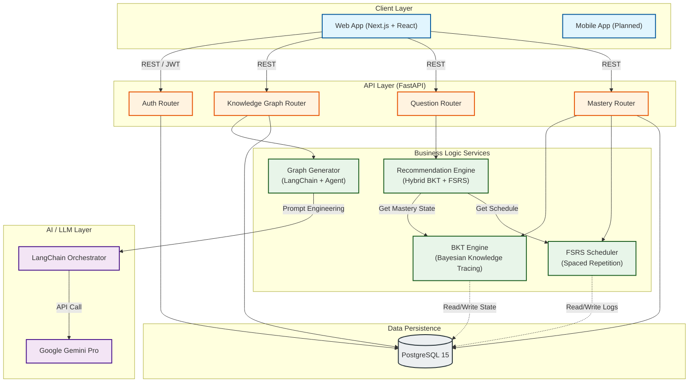

# System Architecture

## Data Flow Description

1.  **Adaptive Learning Loop**:
    *   User requests a question via **Web App**.
    *   **Recommendation Engine** queries **PostgreSQL** for current mastery state.
    *   **FSRS** filters for due reviews.
    *   **BKT** prioritizes based on prerequisite chains and probability scores.
    *   Optimal question is returned.

2.  **AI Content Generation**:
    *   User uploads a PDF or topic request.
    *   **Graph Generator** uses **LangChain** to construct a prompt.
    *   **Gemini Pro** extracts concepts and relationships.
    *   **Self-Correction Agent** verifies graph topology (DAG structure) before saving to DB.
