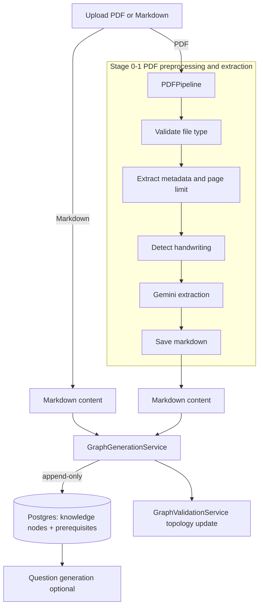

# AI-Driven ETL Data Pipeline

This document describes the ETL pipeline that converts PDFs or Markdown into knowledge graphs and, optionally, quiz questions. It separates current behavior from the planned GraphRAG refactor.

## Current Pipeline (Phase 1)

Goal: create or append knowledge nodes and prerequisites from Markdown (PDFs are converted to Markdown first).
Behavior: append-only inserts; existing nodes and edges are never modified or deleted.
Incremental hook: the `incremental` flag is wired through, but merge logic is still a TODO.

### Flow (Phase 1)



### Stage 0 + 1: PDF pre-processing and extraction

**Orchestrator:** `app/services/pdf_pipeline.py`

Steps:
1. `validate_file_type_stage` (PDF only)
2. `validate_and_extract_metadata_stage` -> `app/utils/pdf_metadata.py`
3. `check_page_limit_stage` (default 100 pages)
4. `detect_handwriting_stage` -> `app/utils/is_handwritten.py`
5. `extract_text_stage` -> `app/services/ai_services/pdf_extraction.py`
6. `save_markdown_stage` -> `app/utils/storage.py`

Extracted Markdown is persisted in `PIPELINE_RESULTS_PATH` to support retries.

### Stage 1: Raw content extraction (Gemini)

**Service:** `app/services/ai_services/pdf_extraction.py`

- Formatted PDFs: `extract_text_from_formatted_pdf` with `PDF_ACADEMIC_OCR_PROMPT`
- Handwritten PDFs: `extract_handwritten_notes` with `PDF_HANDWRITING_PROMPT`

Chunking uses `app/utils/split_pdf.py` (default 20 pages per chunk), with retries via `tenacity`.

Example stage snippet:

```python
async def extract_text_stage(context: dict):
    extractor = PDFExtractionService()
    file_path = context["file_path"]
    is_handwritten = context["metadata"].get("is_handwritten", False)

    if is_handwritten:
        content = await extractor.extract_handwritten_notes(file_path)
    else:
        content = await extractor.extract_text_from_formatted_pdf(file_path)

    context["markdown_content"] = content
```

### Stage 2: Knowledge graph construction

**Service:** `app/services/graph_generation_service.py`

Current behavior:
- `process_markdown` converts Markdown into `GraphStructureLLM`
- Append-only inserts into `knowledge_node` and `prerequisite`
- `GraphValidationService.update_graph_topology` updates levels and dependents

Incremental behavior is planned; the hook exists but merge/dedup logic is still a TODO.

### Stage 3: Assessment creation (optional)

If enabled, leaf nodes are used for question generation and stored in the questions table.

### Context contract (PDF pipeline)

```python
{
    "task_id": "...",
    "file_path": "...",
    "metadata": {
        "page_count": 0,
        "is_handwritten": False,
        "markdown_file_path": "..."
    },
    "markdown_content": "...",
    "graph_id": "...",
    "db_session": "...",
    "incremental": False
}
```

### Storage notes

- Uploads live in `PIPELINE_STORAGE_PATH/task_<task_id>`
- Extracted Markdown is saved under `PIPELINE_RESULTS_PATH`

## GraphRAG + LlamaIndex Refactor Plan

Target: keep existing Postgres schema, use pgvector with Gemini embeddings, preserve append-only behavior, and drop HAS_SUBTOPIC (tags deferred).

### Phase 0: Decisions and boundaries

- Graph schema: keep `knowledge_node` and `prerequisite` (append-only).
- Vector storage: `pgvector` in Postgres, Gemini embeddings, one row per node and/or chunk.
- Tags: reserved for future, excluded for now.

### Phase 1: New graph construction pipeline (LlamaIndex)

1. Ingest Markdown into LlamaIndex `Document` objects with metadata (`graph_id`, `source`, `task_id`).
2. Chunking with LlamaIndex splitter (configurable size/overlap).
3. Graph extraction using Gemini to produce `GraphStructureLLM`-like output.
4. Dedup + merge via deterministic node and edge signatures.
5. Persist:
   - nodes: `knowledge_node` (skip duplicates by `node_id_str`)
   - relationships: `prerequisite` (skip duplicates via unique constraint)
   - embeddings: `pgvector` table for nodes/chunks

### Phase 2: Service layer refactor

- Replace `process_markdown` with a LlamaIndex-based pipeline wrapper.
- Update `GraphGenerationService.create_graph_from_markdown` to call the new pipeline.
- Keep `GraphValidationService.update_graph_topology` unchanged.
- Add a GraphRAG query service:
  - retrieve candidate nodes via vector search
  - expand neighborhoods via prerequisite edges
  - feed context to the LLM for synthesis

### Phase 3: Incremental sync and backfill

- Preserve append-only semantics.
- Optional: backfill embeddings for existing nodes.
- Run topology validation after each batch insert.

### Phase 4: Tests and observability

- Unit tests: graph extraction -> dedup -> persist.
- Integration tests: end-to-end Markdown -> graph + embeddings.
- Metrics: nodes added, edges added, extraction failures, embedding latency.

### Initial file-level touchpoints

- `app/services/graph_generation_service.py`: swap pipeline call, keep append-only.
- `app/services/ai_services/generate_graph.py`: replace with LlamaIndex pipeline.
- `app/core/config.py`: add LlamaIndex and embedding settings.
- `app/services/graph_rag_service.py`: new GraphRAG retrieval + synthesis entry.
